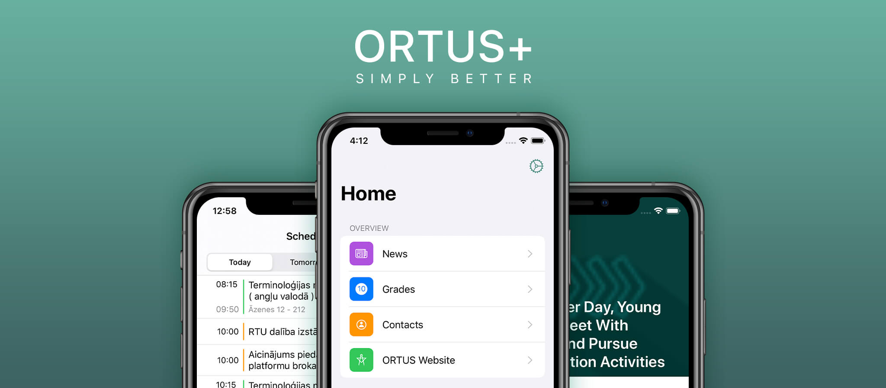

# ORTUS+
  

ORTUS+ is a mobile application for Riga Technical University to provide a better experience for students. Some features:
* Schedule
* Entering to the ORTUS website without entering a password or PIN code
* Grades
* Full courses list
* Notifications
* News

And also:
* Dark mode support
* Home screen quick actions
* iOS native UI

> Join the [TestFlight beta](https://testflight.apple.com/join/kocXDWmm)

## Requirements
* Xcode 12+
* Swift 5.2+

## Building

### Add keys and IDs
Create an extension of `Global` struct, and add:
```swift
extension Global {
    static let clientID = "*YOUR CLIENT ID*"
    static let clientSecret = "*YOUR CLIENT SECRET*"
}
```

## Contribution
Feel free to make pull requests and create issues.
